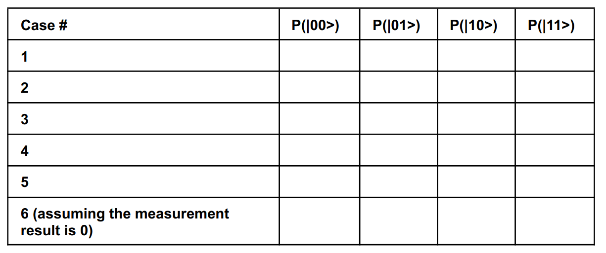

# Lab1: Quirk

## 1- Objectives

* Getting to know Quirk simulator.
* Getting familiar with qubits, their notation, and states.
* Know how to change qubit states using quantum gates.

## 2 - Introduction to Quirk

* [Quirk](https://algassert.com/quirk) is an open-source drag-and-drop quantum circuit simulator for exploring and understanding small quantum circuits.
* Watch [this tutorial](https://www.youtube.com/watch?v=aloFwlBUwsQ) to identify the basic components.

## 3 - Requirements

**Q1: It is required to apply the following on the [Quirk](https://algassert.com/quirk) GUI interface (assume two qubits and system initially in joint state |00>):**

1. Apply a NOT gate (Pauli X gate) to the first qubit. It toggles the qubit state like the classical NOT gate.
2. Start with a fresh circuit. Apply a CNOT gate (Controlled NOT gate). The control is the first qubit and the target is the second qubit. The controlled NOT gate apply the NOT gate to the target qubit if and only if the control qubit is |1>.
3. Start with a fresh circuit. Apply a Hadamard gate (H gate) to the first qubit.The Hadamard gate produces a superposition state with equal probability for |0> and |1> (probability equals 0.5).
4. Start with a fresh circuit. Apply an H gate to the first qubit then apply the CNOT gate where the control is the first qubit and the target is the second qubit.
5. Start with a fresh circuit. Apply an H gate to the first qubit then another H gate. What is the final state? What happens if you replace the two H gates with any two other arbitrary gates? What will be the final state in this case?
6. Start with a fresh circuit. Apply an H gate to the first qubit then measure the qubit.

After applying the previous cases, fill the following table:

**Q2: Think about and draw a circuit with three qubits that produces |000> and |111> with equal probability 0.5.**

## 4 - Deliverables

Use the provided submission form to submit the following:

1. An image of the filled table for Q1.
2. An image of the circuit for Q2.
